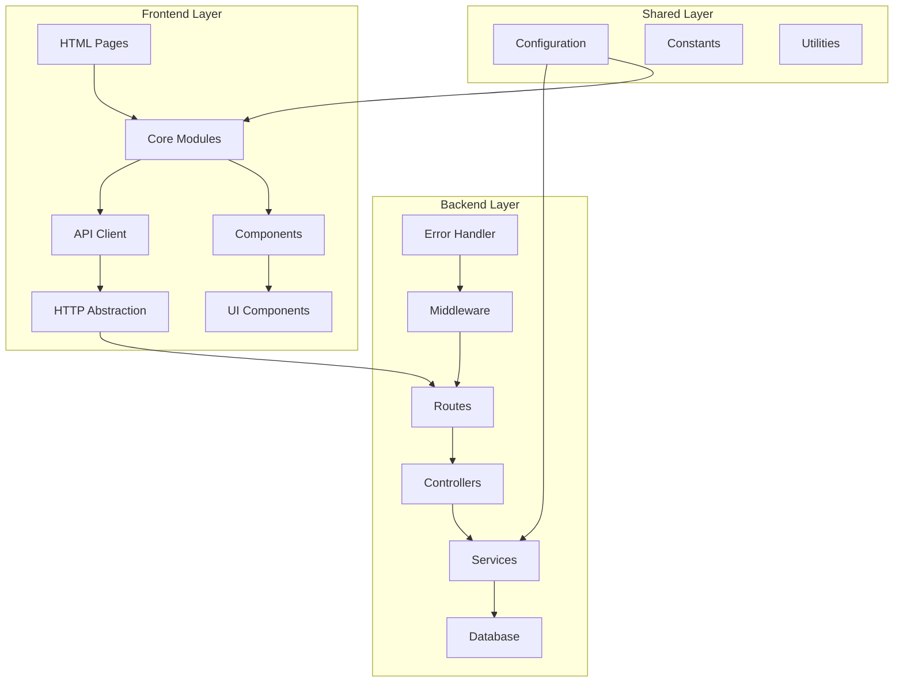

# Design Document - Otimização do Sistema Kanghoo

## Overview

Este documento detalha o design arquitetural para a otimização do Sistema Kanghoo, transformando uma aplicação com código disperso e inconsistente em uma arquitetura modular, maintível e escalável. O design foca na centralização de responsabilidades, padronização de interfaces e implementação de padrões modernos de desenvolvimento web.

## Architecture

### Arquitetura Geral



### Padrões Arquiteturais

1. **Separation of Concerns**: Separação clara entre apresentação, lógica de negócio e acesso a dados
2. **Module Pattern**: Organização em módulos ES6 com imports/exports explícitos
3. **Service Layer Pattern**: Camada de serviços no backend para lógica de negócio
4. **Repository Pattern**: Abstração de acesso a dados
5. **Observer Pattern**: Sistema de eventos para comunicação entre componentes

## Components and Interfaces

### Frontend Core Modules

#### 1. Configuration Module (`core/config.js`)
```javascript
export const CONFIG = {
  API_BASE_URL: window.location.hostname === 'localhost' 
    ? 'http://localhost:3000/api/v1'
    : `${window.location.protocol}//${window.location.host}/api/v1`,
  
  WEBSOCKET_URL: window.location.hostname === 'localhost'
    ? 'ws://localhost:3000'
    : `wss://${window.location.host}`,
    
  CACHE_DURATION: 5 * 60 * 1000, // 5 minutes
  TOKEN_CHECK_INTERVAL: 30 * 1000, // 30 seconds
  
  BREAKPOINTS: {
    sm: '576px',
    md: '768px',
    lg: '992px',
    xl: '1200px'
  }
};
```

#### 2. API Client Module (`core/api-client.js`)
```javascript
class APIClient {
  constructor(baseURL) {
    this.baseURL = baseURL;
    this.defaultHeaders = {
      'Content-Type': 'application/json'
    };
  }

  async request(endpoint, options = {}) {
    const url = `${this.baseURL}${endpoint}`;
    const config = {
      headers: { ...this.defaultHeaders, ...options.headers },
      ...options
    };

    // Add auth token if available
    const token = localStorage.getItem('authToken');
    if (token) {
      config.headers.Authorization = `Bearer ${token}`;
    }

    try {
      const response = await fetch(url, config);
      return await this.handleResponse(response);
    } catch (error) {
      throw new APIError(error.message, error.status);
    }
  }

  // HTTP methods
  get(endpoint, options = {}) {
    return this.request(endpoint, { method: 'GET', ...options });
  }

  post(endpoint, data, options = {}) {
    return this.request(endpoint, {
      method: 'POST',
      body: JSON.stringify(data),
      ...options
    });
  }

  put(endpoint, data, options = {}) {
    return this.request(endpoint, {
      method: 'PUT',
      body: JSON.stringify(data),
      ...options
    });
  }

  delete(endpoint, options = {}) {
    return this.request(endpoint, { method: 'DELETE', ...options });
  }
}

export const apiClient = new APIClient(CONFIG.API_BASE_URL);
```

#### 3. Authentication Manager (`core/auth-manager.js`)
```javascript
class AuthManager {
  constructor() {
    this.tokenCheckInterval = null;
    this.eventListeners = new Map();
    this.init();
  }

  init() {
    this.setupEventListeners();
    this.startTokenCheck();
  }

  setupEventListeners() {
    window.addEventListener('focus', () => this.checkAuthentication());
    document.addEventListener('visibilitychange', () => {
      if (!document.hidden) this.checkAuthentication();
    });
    window.addEventListener('pageshow', () => this.checkAuthentication());
  }

  async checkAuthentication() {
    const token = localStorage.getItem('authToken');
    if (!token) {
      this.redirectToLogin();
      return false;
    }

    try {
      const response = await apiClient.get('/auth/verify');
      if (!response.success) {
        this.handleAuthFailure();
        return false;
      }
      return true;
    } catch (error) {
      this.handleAuthFailure();
      return false;
    }
  }

  startTokenCheck() {
    this.tokenCheckInterval = setInterval(() => {
      this.checkAuthentication();
    }, CONFIG.TOKEN_CHECK_INTERVAL);
  }

  getRedirectUrlByUserType(userType) {
    const routes = {
      'motorista_escolar': '/auth/area-motorista-escolar.html',
      'motorista_excursao': '/auth/area-motorista-excursao.html',
      'responsavel': '/auth/area-responsavel.html',
      'admin': '/auth/admin-dashboard.html'
    };

    // Special case for dual role
    if (userType === 'motorista_escolar_excursao') {
      return this.showRoleSelectionModal();
    }

    return routes[userType] || '/auth/login.html';
  }

  showRoleSelectionModal() {
    // Implementation for role selection modal
    return new Promise((resolve) => {
      // Modal implementation
    });
  }

  redirectToLogin() {
    try {
      window.location.href = '/auth/login.html';
    } catch (error) {
      console.error('Redirect failed:', error);
      // Fallback
      window.location.href = '/auth/login.html';
    }
  }
}

export const authManager = new AuthManager();
```

#### 4. Notification System (`core/notifications.js`)
```javascript
class NotificationSystem {
  constructor() {
    this.container = null;
    this.notifications = new Map();
    this.init();
  }

  init() {
    this.createContainer();
  }

  createContainer() {
    this.container = document.createElement('div');
    this.container.className = 'notification-container';
    document.body.appendChild(this.container);
  }

  show(type, message, options = {}) {
    const notification = this.createNotification(type, message, options);
    this.container.appendChild(notification);
    
    // Auto-remove after duration
    setTimeout(() => {
      this.remove(notification.id);
    }, options.duration || 5000);

    // Persist if required
    if (options.persist) {
      this.persistNotification(type, message, options);
    }

    return notification.id;
  }

  success(message, options = {}) {
    return this.show('success', message, options);
  }

  error(message, options = {}) {
    return this.show('error', message, { duration: 8000, ...options });
  }

  info(message, options = {}) {
    return this.show('info', message, options);
  }

  warning(message, options = {}) {
    return this.show('warning', message, { duration: 6000, ...options });
  }
}

export const notifications = new NotificationSystem();
```

#### 5. Form Validator (`core/form-validator.js`)
```javascript
class FormValidator {
  constructor() {
    this.rules = {
      required: (value) => value.trim() !== '',
      email: (value) => /^[^\s@]+@[^\s@]+\.[^\s@]+$/.test(value),
      cpf: (value) => this.validateCPF(value),
      phone: (value) => /^\(\d{2}\)\s\d{4,5}-\d{4}$/.test(value),
      minLength: (value, min) => value.length >= min,
      maxLength: (value, max) => value.length <= max
    };

    this.messages = {
      required: 'Este campo é obrigatório',
      email: 'Digite um email válido',
      cpf: 'Digite um CPF válido',
      phone: 'Digite um telefone válido',
      minLength: 'Mínimo de {min} caracteres',
      maxLength: 'Máximo de {max} caracteres'
    };
  }

  validateField(field, rules) {
    const errors = [];
    const value = field.value;

    for (const rule of rules) {
      const [ruleName, ...params] = rule.split(':');
      
      if (!this.rules[ruleName]) continue;
      
      const isValid = this.rules[ruleName](value, ...params);
      if (!isValid) {
        errors.push(this.formatMessage(ruleName, params));
      }
    }

    return errors;
  }

  validateForm(form) {
    const errors = {};
    const fields = form.querySelectorAll('[data-validate]');

    fields.forEach(field => {
      const rules = field.dataset.validate.split('|');
      const fieldErrors = this.validateField(field, rules);
      
      if (fieldErrors.length > 0) {
        errors[field.name] = fieldErrors;
      }
    });

    return {
      isValid: Object.keys(errors).length === 0,
      errors
    };
  }

  setupRealTimeValidation(form) {
    const fields = form.querySelectorAll('[data-validate]');
    
    fields.forEach(field => {
      field.addEventListener('blur', () => {
        this.validateAndShowErrors(field);
      });

      field.addEventListener('input', () => {
        this.clearFieldErrors(field);
      });
    });
  }
}

export const formValidator = new FormValidator();
```

### Backend Architecture

#### 1. Route Organization
```
server/routes/
├── auth/
│   └── index.js          # Authentication routes
├── motoristas/
│   ├── escolar.js        # School driver routes
│   ├── excursao.js       # Trip driver routes
│   └── simple.js         # Simple driver routes
├── responsaveis/
│   └── index.js          # Parent/guardian routes
├── criancas/
│   ├── cadastro.js       # Child registration
│   ├── conferencia.js    # Child check-in/out
│   └── posicao.js        # Child location
├── rastreamento/
│   ├── gps.js           # GPS tracking
│   ├── tracking.js      # Real-time tracking
│   └── atualizacao-posicao.js
└── index.js             # Route aggregator
```

#### 2. Service Layer Architecture
```javascript
// services/base-service.js
class BaseService {
  constructor(repository) {
    this.repository = repository;
  }

  async findById(id) {
    try {
      return await this.repository.findById(id);
    } catch (error) {
      throw new ServiceError(`Failed to find record: ${error.message}`);
    }
  }

  async create(data) {
    try {
      const validatedData = await this.validate(data);
      return await this.repository.create(validatedData);
    } catch (error) {
      throw new ServiceError(`Failed to create record: ${error.message}`);
    }
  }

  async validate(data) {
    // Override in child classes
    return data;
  }
}

// services/auth-service.js
class AuthService extends BaseService {
  async authenticate(credentials) {
    const { email, password } = credentials;
    
    // Validate credentials
    const user = await this.repository.findByEmail(email);
    if (!user || !await this.verifyPassword(password, user.password)) {
      throw new AuthenticationError('Invalid credentials');
    }

    // Generate token
    const token = this.generateToken(user);
    
    // Update last login
    await this.repository.updateLastLogin(user.id);

    return {
      user: this.sanitizeUser(user),
      token,
      expiresIn: '24h'
    };
  }

  async verifyToken(token) {
    try {
      const decoded = jwt.verify(token, process.env.JWT_SECRET);
      const user = await this.repository.findById(decoded.userId);
      
      if (!user || !user.active) {
        throw new AuthenticationError('Invalid token');
      }

      return this.sanitizeUser(user);
    } catch (error) {
      throw new AuthenticationError('Token verification failed');
    }
  }
}
```

#### 3. Error Handling System
```javascript
// middleware/error-handler.js
class ErrorHandler {
  static handle(error, ctx) {
    const errorResponse = {
      success: false,
      message: error.message,
      code: error.code || 'INTERNAL_ERROR',
      timestamp: new Date().toISOString()
    };

    // Log error
    logger.error('API Error:', {
      error: error.message,
      stack: error.stack,
      url: ctx.url,
      method: ctx.method,
      userId: ctx.user?.id
    });

    // Set appropriate status code
    ctx.status = error.status || 500;

    // Add additional info in development
    if (process.env.NODE_ENV === 'development') {
      errorResponse.stack = error.stack;
    }

    ctx.body = errorResponse;
  }

  static async middleware(ctx, next) {
    try {
      await next();
    } catch (error) {
      ErrorHandler.handle(error, ctx);
    }
  }
}

// Custom error classes
class APIError extends Error {
  constructor(message, status = 500, code = 'API_ERROR') {
    super(message);
    this.status = status;
    this.code = code;
    this.name = this.constructor.name;
  }
}

class ValidationError extends APIError {
  constructor(message, errors = {}) {
    super(message, 400, 'VALIDATION_ERROR');
    this.errors = errors;
  }
}

class AuthenticationError extends APIError {
  constructor(message) {
    super(message, 401, 'AUTHENTICATION_ERROR');
  }
}
```

## Data Models

### Frontend Data Models

#### 1. User Model
```javascript
class User {
  constructor(data) {
    this.id = data.id;
    this.name = data.name;
    this.email = data.email;
    this.userType = data.user_type;
    this.active = data.active;
    this.preferences = data.preferences || {};
    this.lastLogin = data.last_login;
  }

  hasRole(role) {
    return this.userType === role || this.userType.includes(role);
  }

  getRedirectUrl() {
    return authManager.getRedirectUrlByUserType(this.userType);
  }

  updatePreference(key, value) {
    this.preferences[key] = value;
    cacheManager.setUserPreference(key, value);
  }
}
```

#### 2. API Response Model
```javascript
class APIResponse {
  constructor(data) {
    this.success = data.success;
    this.message = data.message;
    this.data = data.data;
    this.errors = data.errors;
    this.meta = data.meta;
  }

  isSuccess() {
    return this.success === true;
  }

  hasErrors() {
    return this.errors && Object.keys(this.errors).length > 0;
  }

  getFirstError() {
    if (!this.hasErrors()) return null;
    const firstKey = Object.keys(this.errors)[0];
    return this.errors[firstKey][0];
  }
}
```

### Backend Data Models

#### 1. Database Schema Updates
```sql
-- Add configuration table for centralized settings
CREATE TABLE IF NOT EXISTS system_config (
    id SERIAL PRIMARY KEY,
    key VARCHAR(100) UNIQUE NOT NULL,
    value TEXT NOT NULL,
    description TEXT,
    type VARCHAR(20) DEFAULT 'string',
    created_at TIMESTAMP WITH TIME ZONE DEFAULT CURRENT_TIMESTAMP,
    updated_at TIMESTAMP WITH TIME ZONE DEFAULT CURRENT_TIMESTAMP
);

-- Add user preferences table
CREATE TABLE IF NOT EXISTS user_preferences (
    id SERIAL PRIMARY KEY,
    user_id INTEGER REFERENCES usuarios(id) ON DELETE CASCADE,
    preference_key VARCHAR(100) NOT NULL,
    preference_value TEXT NOT NULL,
    created_at TIMESTAMP WITH TIME ZONE DEFAULT CURRENT_TIMESTAMP,
    updated_at TIMESTAMP WITH TIME ZONE DEFAULT CURRENT_TIMESTAMP,
    UNIQUE(user_id, preference_key)
);

-- Add API routes configuration table
CREATE TABLE IF NOT EXISTS api_routes (
    id SERIAL PRIMARY KEY,
    route_name VARCHAR(100) UNIQUE NOT NULL,
    route_path VARCHAR(200) NOT NULL,
    method VARCHAR(10) NOT NULL,
    version VARCHAR(10) DEFAULT 'v1',
    active BOOLEAN DEFAULT true,
    created_at TIMESTAMP WITH TIME ZONE DEFAULT CURRENT_TIMESTAMP
);
```

## Error Handling

### Frontend Error Handling

#### 1. Global Error Handler
```javascript
class GlobalErrorHandler {
  constructor() {
    this.setupGlobalHandlers();
  }

  setupGlobalHandlers() {
    // Handle unhandled promise rejections
    window.addEventListener('unhandledrejection', (event) => {
      this.handleError(event.reason);
      event.preventDefault();
    });

    // Handle JavaScript errors
    window.addEventListener('error', (event) => {
      this.handleError(event.error);
    });

    // Handle API errors
    document.addEventListener('api-error', (event) => {
      this.handleAPIError(event.detail);
    });
  }

  handleError(error) {
    console.error('Global error:', error);
    
    // Log to external service in production
    if (CONFIG.ENVIRONMENT === 'production') {
      this.logToService(error);
    }

    // Show user-friendly message
    notifications.error('Ocorreu um erro inesperado. Tente novamente.');
  }

  handleAPIError(error) {
    const userMessage = this.getUserFriendlyMessage(error);
    notifications.error(userMessage);
  }

  getUserFriendlyMessage(error) {
    const messages = {
      'NETWORK_ERROR': 'Erro de conexão. Verifique sua internet.',
      'AUTHENTICATION_ERROR': 'Sessão expirada. Faça login novamente.',
      'VALIDATION_ERROR': 'Dados inválidos. Verifique os campos.',
      'PERMISSION_ERROR': 'Você não tem permissão para esta ação.',
      'NOT_FOUND': 'Recurso não encontrado.',
      'SERVER_ERROR': 'Erro interno do servidor. Tente novamente.'
    };

    return messages[error.code] || error.message || 'Erro desconhecido';
  }
}

export const globalErrorHandler = new GlobalErrorHandler();
```

### Backend Error Handling

#### 1. Structured Error Response
```javascript
const ErrorResponse = {
  success: false,
  message: 'Error message',
  code: 'ERROR_CODE',
  errors: {}, // Field-specific errors
  meta: {
    timestamp: '2024-01-01T00:00:00Z',
    requestId: 'uuid',
    path: '/api/v1/endpoint'
  }
};
```

#### 2. Error Codes
```javascript
const ERROR_CODES = {
  // Authentication
  AUTH_INVALID_CREDENTIALS: 'AUTH_001',
  AUTH_TOKEN_EXPIRED: 'AUTH_002',
  AUTH_TOKEN_INVALID: 'AUTH_003',
  AUTH_INSUFFICIENT_PERMISSIONS: 'AUTH_004',

  // Validation
  VALIDATION_REQUIRED_FIELD: 'VAL_001',
  VALIDATION_INVALID_FORMAT: 'VAL_002',
  VALIDATION_DUPLICATE_VALUE: 'VAL_003',

  // Business Logic
  BUSINESS_RULE_VIOLATION: 'BUS_001',
  RESOURCE_NOT_FOUND: 'BUS_002',
  RESOURCE_CONFLICT: 'BUS_003',

  // System
  DATABASE_ERROR: 'SYS_001',
  EXTERNAL_SERVICE_ERROR: 'SYS_002',
  INTERNAL_SERVER_ERROR: 'SYS_003'
};
```

## Testing Strategy

### Frontend Testing

#### 1. Unit Tests
- Test individual modules (auth-manager, api-client, form-validator)
- Mock external dependencies
- Test error scenarios
- Validate input/output contracts

#### 2. Integration Tests
- Test module interactions
- Test API communication
- Test authentication flows
- Test form validation integration

#### 3. E2E Tests
- Test complete user workflows
- Test cross-browser compatibility
- Test responsive design
- Test accessibility compliance

### Backend Testing

#### 1. Unit Tests
- Test service layer methods
- Test utility functions
- Test error handling
- Test data validation

#### 2. Integration Tests
- Test API endpoints
- Test database operations
- Test middleware functionality
- Test authentication/authorization

#### 3. Performance Tests
- Test API response times
- Test concurrent user scenarios
- Test database query performance
- Test memory usage

### Testing Tools and Framework

```javascript
// Frontend testing setup
// jest.config.js
module.exports = {
  testEnvironment: 'jsdom',
  setupFilesAfterEnv: ['<rootDir>/tests/setup.js'],
  moduleNameMapping: {
    '^@/(.*)$': '<rootDir>/frontend/public/assets/js/$1'
  },
  collectCoverageFrom: [
    'frontend/public/assets/js/**/*.js',
    '!frontend/public/assets/js/vendors/**'
  ],
  coverageThreshold: {
    global: {
      branches: 80,
      functions: 80,
      lines: 80,
      statements: 80
    }
  }
};

// Backend testing setup
// tests/helpers/test-db.js
class TestDatabase {
  static async setup() {
    // Setup test database
    await this.createTables();
    await this.seedTestData();
  }

  static async teardown() {
    // Clean up test database
    await this.dropTables();
  }

  static async reset() {
    // Reset between tests
    await this.clearData();
    await this.seedTestData();
  }
}
```

Este design fornece uma base sólida para a modernização do Sistema Kanghoo, com foco em modularidade, manutenibilidade e escalabilidade. A implementação seguirá padrões modernos de desenvolvimento web e garantirá uma experiência consistente para usuários e desenvolvedores.