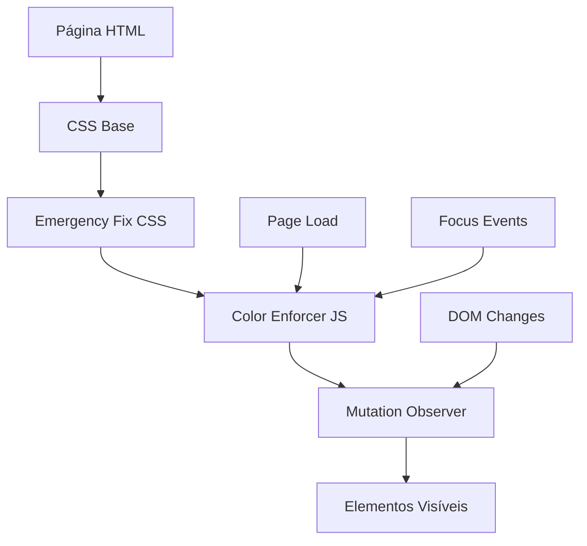

# Documento de Design - Correções de UI/UX Sistema Kanghoo

## Overview

Este documento detalha a arquitetura e implementação das correções de visibilidade e interface do usuário para o Sistema Kanghoo. O design foca em uma abordagem híbrida usando CSS forçado e JavaScript dinâmico para garantir que todos os elementos sejam visíveis independentemente de conflitos de CSS existentes.

## Architecture

### Arquitetura de Correção em Camadas



### Componentes Principais

1. **Emergency Fix CSS**: Correções absolutas via `!important`
2. **Color Enforcer JS**: Sistema dinâmico de detecção e correção
3. **Mutation Observer**: Monitoramento de mudanças no DOM
4. **Page-Specific Fixes**: Correções customizadas por página

## Components and Interfaces

### 1. Enhanced Color Enforcer Class

```javascript
class EnhancedColorEnforcer {
  constructor(config = {})
  
  // Core Methods
  init()
  enforceColors()
  detectInvisibleElements()
  applyPageSpecificFixes()
  
  // Monitoring Methods
  startMonitoring()
  logCorrections()
  generateReport()
  
  // Debug Methods
  debugMode()
  highlightProblems()
  testVisibility()
}
```

### 2. CSS Emergency System

```css
/* Estrutura hierárquica de correções */
.emergency-fix-level-1 { /* Correções básicas */ }
.emergency-fix-level-2 { /* Correções específicas */ }
.emergency-fix-level-3 { /* Correções forçadas */ }
```

### 3. Page Detection System

```javascript
class PageDetector {
  getCurrentPage()
  getPageType()
  getPageElements()
  getPageSpecificSelectors()
}
```

### 4. Visibility Monitor

```javascript
class VisibilityMonitor {
  scanForInvisibleElements()
  checkContrast()
  validateAccessibility()
  reportIssues()
}
```

## Data Models

### Color Configuration

```javascript
const colorConfig = {
  primary: {
    text: '#242f57',
    background: '#ffffff',
    accent: '#f7d22f'
  },
  secondary: {
    text: '#333333',
    lightText: '#666666',
    background: '#f8f9fa'
  },
  interactive: {
    link: '#3b82f6',
    button: '#f7d22f',
    hover: '#e6c200'
  },
  status: {
    success: '#28a745',
    warning: '#ffc107',
    error: '#dc3545',
    info: '#17a2b8'
  }
};
```

### Page Element Mapping

```javascript
const pageElementMap = {
  'planos.html': {
    selectors: ['.plan-card', '.pricing-card', '.plan-title'],
    fixes: ['planCardFix', 'pricingFix']
  },
  'sobre.html': {
    selectors: ['.about-hero', '.about-content'],
    fixes: ['heroFix', 'contentFix']
  },
  'index.html': {
    selectors: ['.hero-section', '.solution-card'],
    fixes: ['heroFix', 'solutionCardFix']
  }
};
```

### Correction Log Model

```javascript
const correctionLog = {
  timestamp: Date,
  page: String,
  element: String,
  issue: String,
  correction: String,
  success: Boolean
};
```

## Error Handling

### 1. Graceful Degradation

```javascript
// Fallback para quando JavaScript falha
.css-fallback {
  color: #333333 !important;
  background-color: #ffffff !important;
}
```

### 2. Error Recovery System

```javascript
class ErrorRecovery {
  handleCSSFailure()
  handleJSFailure()
  applyEmergencyFallback()
  notifyDeveloper()
}
```

### 3. Performance Safeguards

```javascript
// Throttling para evitar sobrecarga
const throttledEnforce = throttle(enforceColors, 100);

// Timeout para evitar loops infinitos
const safeExecute = (fn, timeout = 5000) => {
  return Promise.race([
    fn(),
    new Promise((_, reject) => 
      setTimeout(() => reject(new Error('Timeout')), timeout)
    )
  ]);
};
```

## Testing Strategy

### 1. Automated Visibility Testing

```javascript
class VisibilityTester {
  testContrastRatio(element)
  testElementVisibility(selector)
  testPageAccessibility(page)
  generateAccessibilityReport()
}
```

### 2. Cross-Browser Testing Matrix

| Browser | Version | Test Cases |
|---------|---------|------------|
| Chrome | 90+ | Todos os cenários |
| Firefox | 88+ | Todos os cenários |
| Safari | 14+ | Todos os cenários |
| Edge | 90+ | Todos os cenários |

### 3. Performance Testing

```javascript
// Métricas de performance
const performanceMetrics = {
  correctionTime: 0,
  elementsProcessed: 0,
  memoryUsage: 0,
  domMutations: 0
};
```

### 4. Visual Regression Testing

```javascript
// Captura de screenshots para comparação
class VisualTester {
  captureScreenshot(page)
  compareWithBaseline(current, baseline)
  detectVisualChanges()
  reportRegressions()
}
```

## Implementation Phases

### Phase 1: Enhanced Detection System
- Melhorar algoritmo de detecção de elementos invisíveis
- Implementar verificação de contraste automática
- Adicionar detecção de elementos com opacity/visibility issues

### Phase 2: Smart Correction Engine
- Sistema inteligente que aplica correções mínimas necessárias
- Preservação de estilos existentes quando possível
- Correções contextuais baseadas no tipo de elemento

### Phase 3: Real-time Monitoring
- Observer pattern para mudanças no DOM
- Logging detalhado de correções aplicadas
- Dashboard de monitoramento para desenvolvedores

### Phase 4: Performance Optimization
- Lazy loading de correções
- Caching de seletores e estilos
- Otimização de queries DOM

## Security Considerations

### 1. CSS Injection Prevention
```javascript
// Sanitização de estilos dinâmicos
const sanitizeStyle = (style) => {
  const allowedProperties = ['color', 'background-color', 'opacity', 'visibility'];
  return Object.keys(style)
    .filter(key => allowedProperties.includes(key))
    .reduce((obj, key) => {
      obj[key] = style[key];
      return obj;
    }, {});
};
```

### 2. XSS Protection
```javascript
// Validação de seletores CSS
const validateSelector = (selector) => {
  const dangerousPatterns = [/javascript:/i, /expression\(/i, /url\(/i];
  return !dangerousPatterns.some(pattern => pattern.test(selector));
};
```

## Accessibility Compliance

### WCAG 2.1 AA Standards
- Contraste mínimo de 4.5:1 para texto normal
- Contraste mínimo de 3:1 para texto grande
- Suporte a leitores de tela
- Navegação por teclado

### Implementation
```javascript
const accessibilityChecker = {
  checkContrast: (foreground, background) => {
    const ratio = calculateContrastRatio(foreground, background);
    return ratio >= 4.5;
  },
  
  checkFocusVisibility: (element) => {
    return element.style.outline !== 'none';
  },
  
  checkAriaLabels: (element) => {
    return element.hasAttribute('aria-label') || 
           element.hasAttribute('aria-labelledby');
  }
};
```

## Monitoring and Analytics

### Real-time Metrics
```javascript
const metricsCollector = {
  invisibleElementsDetected: 0,
  correctionsApplied: 0,
  performanceImpact: 0,
  userReports: 0
};
```

### Reporting Dashboard
- Elementos corrigidos por página
- Tempo de execução das correções
- Impacto na performance
- Relatórios de acessibilidade

## Browser Compatibility

### Modern Browser Support
- Chrome 90+
- Firefox 88+
- Safari 14+
- Edge 90+

### Fallback Strategy
```css
/* Fallback para navegadores antigos */
@supports not (css-custom-properties: 1) {
  .fallback-colors {
    color: #333333;
    background-color: #ffffff;
  }
}
```

## Deployment Strategy

### 1. Staged Rollout
- Desenvolvimento: Testes completos
- Staging: Validação com dados reais
- Produção: Deploy gradual com monitoramento

### 2. Feature Flags
```javascript
const featureFlags = {
  enhancedDetection: true,
  realTimeMonitoring: true,
  performanceOptimization: false
};
```

### 3. Rollback Plan
- Versioning dos arquivos CSS/JS
- Backup automático de configurações
- Processo de rollback em menos de 5 minutos